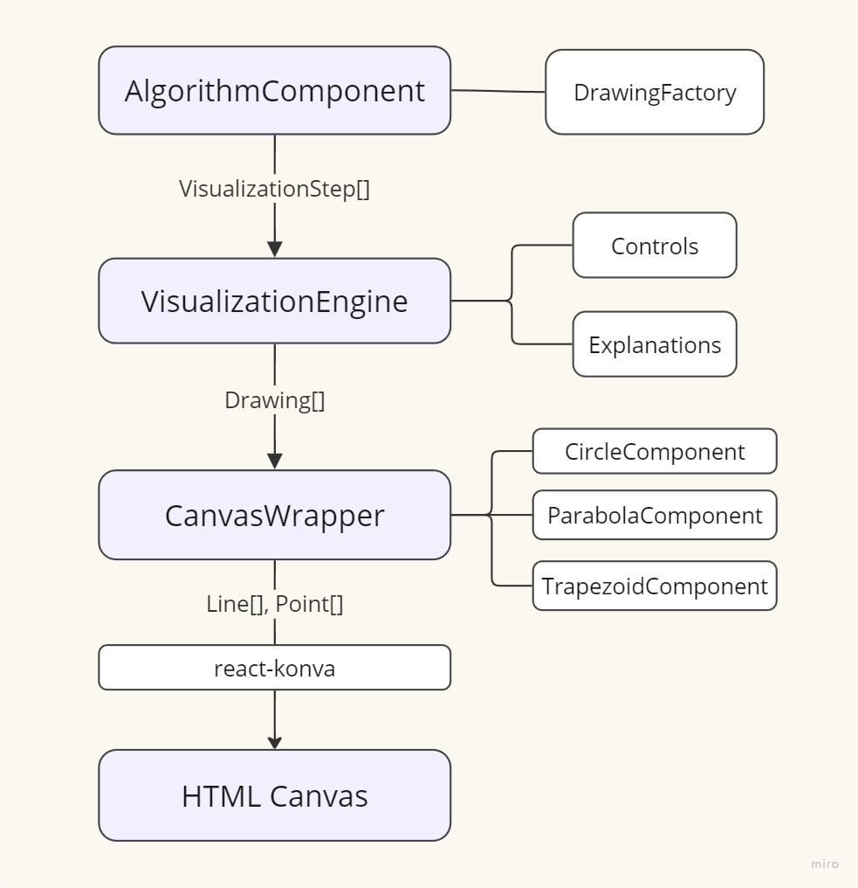

This file contains the necessary information needed to successfully contribute to the project.

## Table of Contents

- [Architecture](#architecture)
- [Contributing to the Project](#contributing-to-the-project)
  - [Issues](#issues)
  - [Developing](#developing)
    - [Unit Tests](#unit-tests)
    - [End-to-End Tests](#end-to-end-tests)
  - [Creating a Commit](#creating-a-commit)
- [Deployment](#deployment)

## Architecture

The app architecture is pretty simple and is roughly depicted in the diagram below.



<br />

Each algorithm's visualization can be summarized in the following steps:

1. **React Component**: Each algorithm has its own React component (e.g., see _src/components/triangulation_).
2. **Visualization Engine**: Most algorithms use the `VisualizationEngine` component, which provides the common layout, the canvas, and basic controls. The only exception is the Duality algorithm, which is structurally different and does not use this common component.
3. **Visualization Steps**: Each algorithm must generate these steps, integrating and the visualization aspects with the actual implementation of the algorithm (e.g., _triangulation-algorithm.ts_).
4. **Step Details**: Each step includes the explanation and its visual representation.
5. **DrawingFactory**: This factory is used to generate the visual elements (points, lines, etc.) for each step.
6. **Canvas Class**: The `VisualizationEngine` passes the drawings to the `Canvas` class, which is responsible for rendering the figures on the HTML Canvas.

## Contributing to the project

### Issues

If there are any open issues in the GitHub page of the project, feel free to start working on one. Look for those labeled with _good first issue_ if this is your first time working on the project.

You can also add a new issue yourself with whatever you would like to see in the project.

### Developing

Make sure you have the project installed and that you are able to run it. The steps are described in the [main readme](README.md).

#### Unit tests

There are unit tests for some functions throughout the app. I encourage adding unit tests for those functions that have to work well in many different scenarios (e.g., for a function determining the position of a point with respect to a segment, the tests should cover the situations where the point is on the line, above / below it, when the point is one of the end points of the segment etc.)

Run the unit tests with `npm test`.

#### End-to-end tests

End-to-end tests are useful to test (some) scenarios for each algorithm. Testing a visual app like this is hard to do only with unit tests, especially because of the canvas. I used the [_cypress_image_diff_](https://cypress.visual-image-diff.dev/) library for visual testing. When running the E2E tests for the first time, it saves screenshots in the _cypress-image-diff-screenshots/baseline_ folder. Upon further runs, it saves the screenshots in the _comparison_ folder, and shows the difference between any two corresponding images in the _diff_ folder (if there are any). The baseline images have to be deleted in order to generate a new baseline (e.g. when you change an implementation intentionally).

Run the end-to-end tests with `npm run test:e2e` in a terminal or with `npm run cy:open` to open the cypress GUI.

#### Creating a commit

After you have successfully implemented a feature or fixed a bug, follow these steps to create a pull request:

1. **Stage your changes**: Add the files you want to commit.

   ```bash
   git add .
   ```

2. **Commit your changes**: Add a meaningful commit message. I recommend using the [conventional commits](https://www.conventionalcommits.org/en/v1.0.0/) format.

   ```bash
   git commit -m "feat: add detailed explanation for triangulation algorithm"
   ```

3. **Push to your branch**: Push your changes to your branch on GitHub.
   ```bash
   git push origin your-branch-name
   ```
4. **Create a Pull Request**: Go to the GitHub repository, and you will see a prompt to create a pull request. Follow the instructions to complete the process.

### Deployment

Whenever a new commit has been added and you want to deploy the changes, follow these steps.

1. Make sure you are on the `main` branch (`git checkout main`)
2. Run `npm run deploy -- -m "<Custom commit message>"` (with a meaningful commit message >)
3. Wait a bit until your changes are deployed
